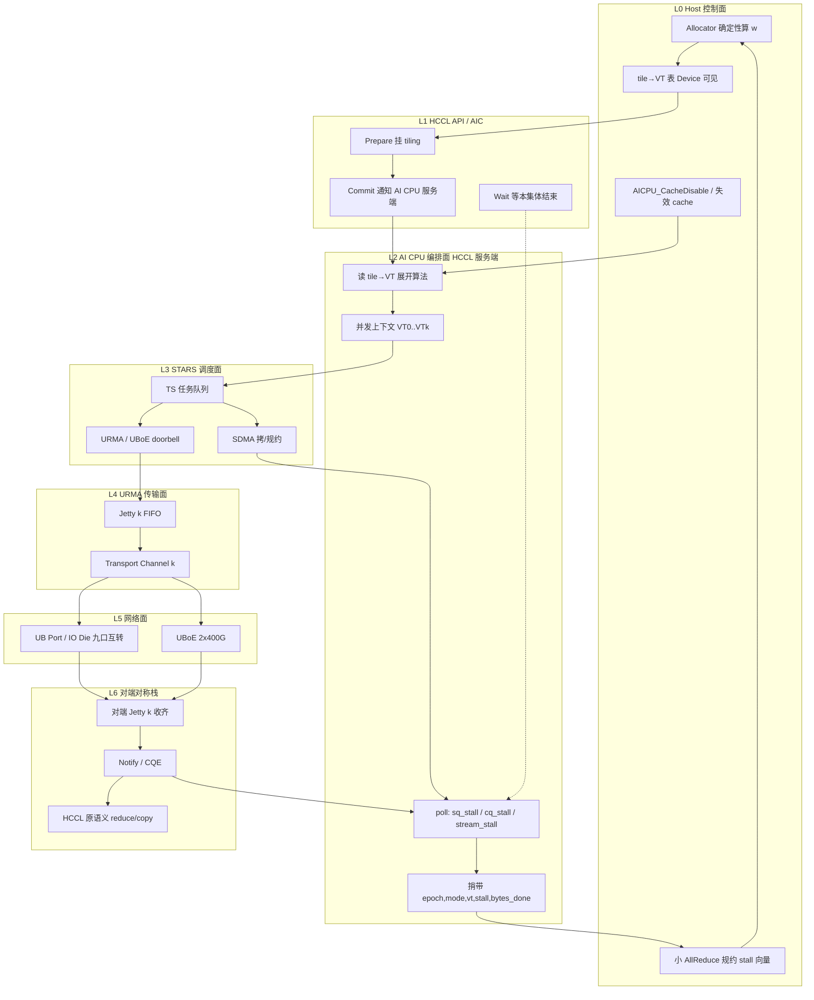
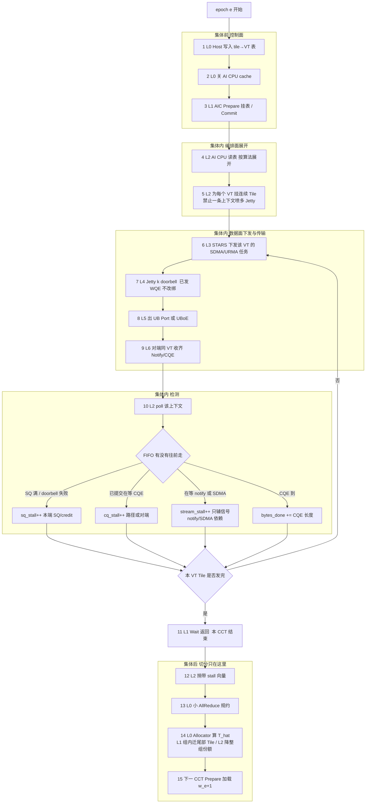
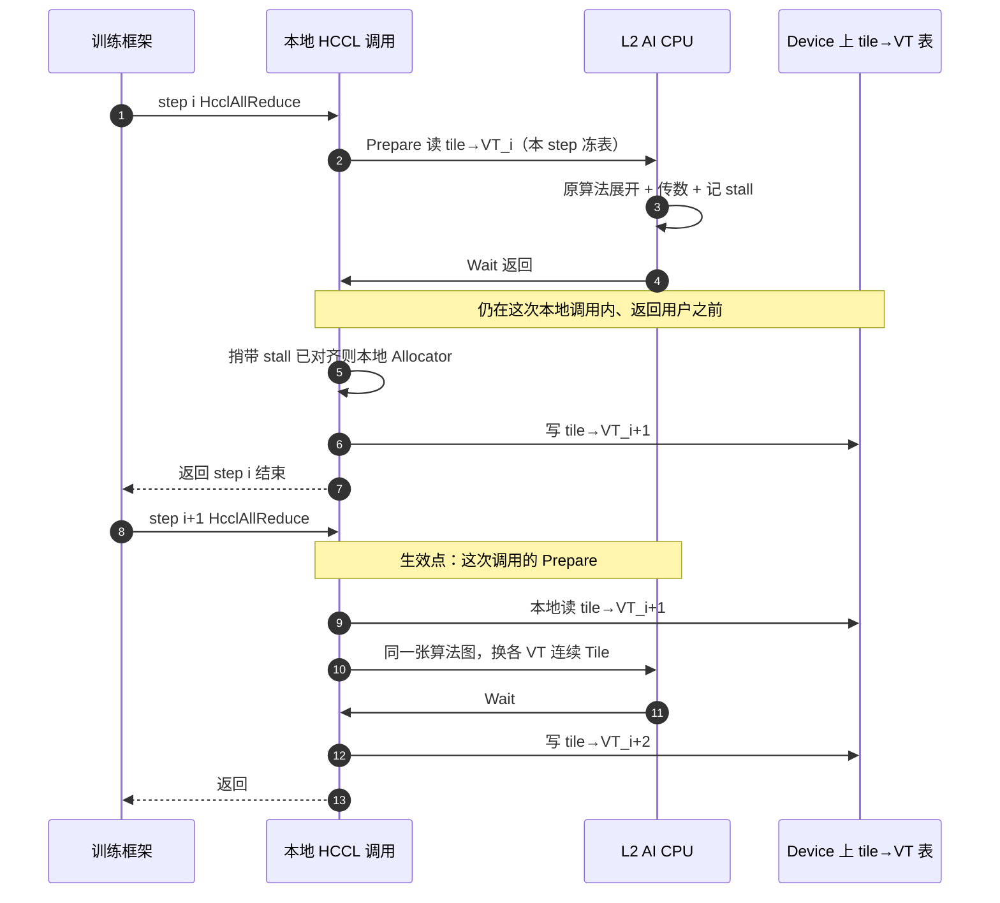
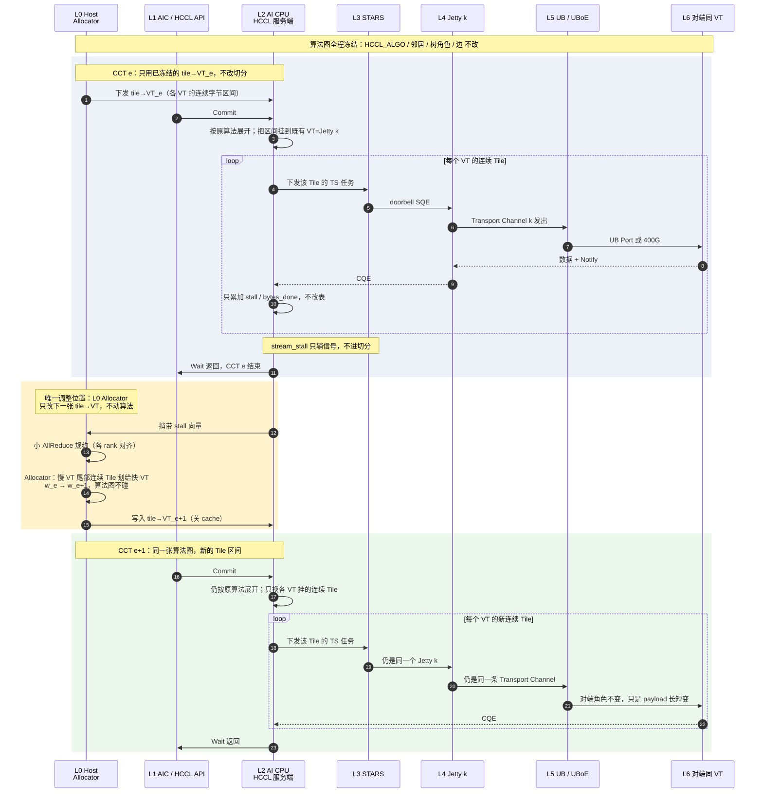
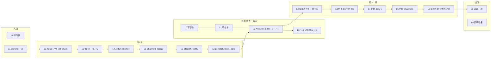
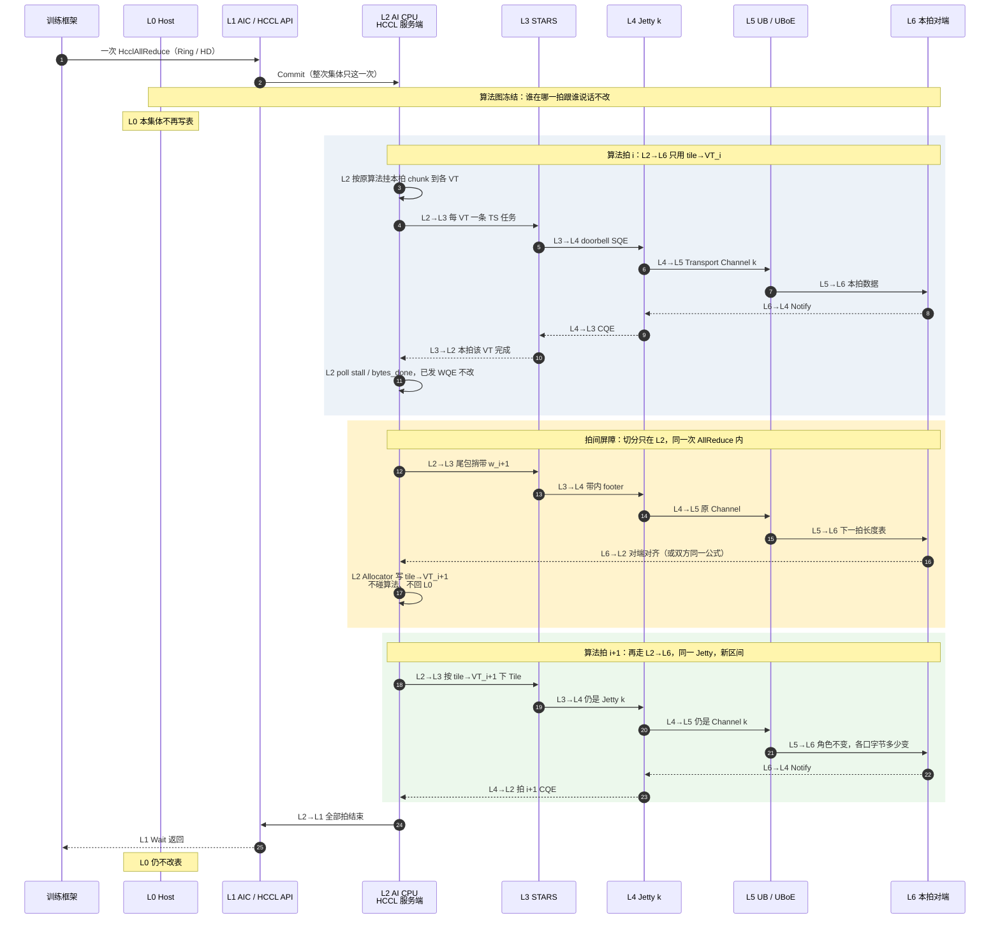

# 昇腾 950 上实现 PReCCL 式运行时拥塞检测与数据切分

按 HCCL 展开模式拆成两套落地路径：

- **AI CPU 模式**（`AI_CPU` / `AICPU_TS`）：算子在片上 AI CPU 展开，经 STARS 下发。950PR/950DT 默认值是 `AICPU_TS`（与 `AI_CPU` 等价，后者后续废弃）。
- **CCU 调度模式**（`CCU_SCHED`）：CCU 当调度器，向 UB 引擎下 UB WQE，不用 CcuBuffer，rank 间片上内存直传。

目标在两种模式里相同：**不换 HCCL 算法图、不拆单 Jetty 保序、不中途切集体**，把一次集体的字节从慢 VT 迁到快 VT，让各 VT 完成时间对齐。

不在本方案范围：换整张 schedule（Theseus）、MoE DeepEP/UBEP 式 P2P 编排（FAST）、传输层改 DCQCN/PFC、`CCU_MS`（950PR 不支持）、`AIV`（小消息，不做动态切分）。

---

## 0. 两种模式先对照

官方语义（CANN `HCCL_OP_EXPANSION_MODE`，950PR/950DT）：

| 项 | AI CPU（`AICPU_TS`） | CCU 调度（`CCU_SCHED`） |
| --- | --- | --- |
| 谁展开算法 | 片上 AI CPU | CCU |
| 谁下发硬件任务 | AI CPU → STARS（TS）→ SDMA / URMA / UBoE | CCU → UB 引擎（UB WQE） |
| 数据路径 | HBM↔HBM，可走 UB 与 UBoE | 不用 CcuBuffer，rank 间片上内存直传（UB 域） |
| 默认 | 950 默认 | 需显式打开 |
| 算子覆盖 | 超节点内 + 超节点间全集 | 面向 UB 调度；单机大 Reduce/RS/AR 会自动回退 AI CPU |
| 资源不够 | 本身就是回退目标 | 回退到 AI CPU |
| 图模式 | 单卡并发图 ≤ 6，否则 AI CPU 核占满会堵通信 | 不吃这条 6 图上限，但吃 32 路 CCU 任务上限 |
| 展开缓存 | AI CPU cache 复用首次展开；动态切分必须关或失效 | 无 AI CPU cache；图捕获仍会冻 tile→VT 表 |
| 本方案 VT | AI CPU 并发上下文 k = 1 Jetty | CCU Mission k = 1 Jetty |
| 推荐 VT 数 | UB 4～8，UBoE 4 | UB 8～16，UBoE 4（UBoE 层常仍走 AI CPU） |
| 推荐 Tile | UB 1～4MB，UBoE 128～512KB | UB 512KB～2MB，UBoE 64～256KB |
| stall 记在哪 | AI CPU 等 CQE / Notify / stream 的 poll | CCU Mission 等 UB 完成的 poll |
| 主战场 | 超节点间 UBoE、大消息、CCU 回退、图模式兜底 | 超节点内 UB、计算通信融合、低展开开销 |

硬规格（两种模式共用上限）：

- STARS 最多并发 **32 个 CCU 任务**、**64 个 UB Jetty**、**32 条 SDMA**。
- URMA RTP：可靠、约 4 Port，多 Transport Channel。CTP：无端到端重传，约 9 Port。
- IO Die **9 个 x4 Port** 可互转，不进计算 Die、不占 HBM。

共享不变量（两种模式都成立）：

```text
一条 VT 只绑一个 Jetty、一条 Transport Channel
一次集体开始前冻结 tile→VT
禁止改已下发的 WQE
跨芯片时钟不可比，只比本 FIFO 有没有往前走
权重只由主信号 T_hat 决定
epoch 只在集体边界换表
分配器是确定性纯函数，禁止每 VT 独立 AIMD
```

完成时间估计（公式相同，标定必须用**本模式自己的** stall）：

```text
T_hat[k] = alpha[k] + bytes_remain[k] / B_hat[k]
B_hat[k] = bytes_done[k] / max(active_time[k], eps)
active_time[k] 用本 VT 自己的 stall 循环次数标定
alpha[k] 用最近 W 个 epoch 的空载/小消息拟合
```

**禁止**把 AI CPU 的 stall 计数和 CCU 的 stall 计数直接比。两种 poll 粒度差一个数量级，只能比各自算出的 `T_hat`。

---

## 1. 共享：切哪一层、切多少

判因（决定切哪一层，不决定切多少）：

```text
组内 VT 的 T_hat 变异系数 > θ_split，且组均值正常
    → L1：组内换 Channel / 迁字节，不换 Port

组内所有 VT 的 T_hat 都 > θ_hot，且辅信号显示该 Port / 该 UBoE 口热
    → L2：降低整组份额
          UB：IO Die 片上转发换出端口（不进 HBM）
          UBoE：经另一 400G 口 + 对端 UB Memory

单 VT 连续 E 个 epoch timeout 或 retry 暴涨
    → 隔离该 VT，保留 min_share 探测；不拆 communicator
      （真故障继续交给 HCCL_OP_RETRY / lane borrowing）
```

分配器（两种模式同一份，Host 上算）：

```text
输入：T_hat[k], B_hat[k], 组标签, 健康位, 上轮权重 w_e, 模式号
输出：w_{e+1}，sum(w)=总字节

1. 按组汇总 T_hat
2. L1：组内按 B_hat 正比分配
3. L2：整组过热则按组降低总额（beta=0.25），补给最冷组
4. clip：
     w[k] >= min_share                 # 建议 1/32
     |w[k]-w_e[k]| <= delta_max * 总字节   # 12.5%～25%
     单组不超过该 Port/口的标定容量
5. 量化到 Tile 个数，余数给当前最快 VT
```

```text
for each group G:
    if all_hot(G): budget[G] *= (1 - beta)
cold = 最冷组
budget[cold] += 从热组扣下的字节
for each group G:
    for vt in G:
        w[vt] = budget[G] * B_hat[vt] / sum(B_hat in G)
quantize_to_tiles(w)
apply_min_share_and_delta(w, w_prev)
```

一次只迁一个组。进入阈值高于退出（滞回）。`T_hat` 指数滑动平均 4～8 个 epoch。

切分单位（两种模式相同）：

```text
用户 buffer
  → 按算法切成 rank 块
    → 每个 rank 块再切成 T 个 Tile
      → 每个 Tile 绑到恰好一个 VT
```

迁徙迁「尾部连续区间」。总字节守恒。Pipeline 只切同一层，不要把超节点内字节改派到超节点间。AlltoAll 不增加扇出。DeepEP/UBEP P2P 关闭。

Epoch：

```text
epoch e:
  1. 所有 rank 用同一张 tile→VT 表 + 同一模式号跑完本次集体
  2. 同步捎带 {epoch, mode, vt_id, stall, bytes_done}
  3. 各 rank 用同一确定性函数算 epoch e+1
  4. 下一次 Prepare 加载新表
```

Agreement 优先用集体同步捎带，不够再走小 AllReduce。训练按 step 收口（step i 改表，step i+1 的 Prepare 生效，见 3.5）；推理 decode 可多步一调或关闭。任一 rank 的 `mode` 与多数不一致：本 epoch **冻权重**，下一集体按实际模式重建 VT 表。

---

## 2. CCU 调度模式（`CCU_SCHED`）

适用：超节点内 UB 上的 TP/EP、中小消息 AllReduce/RS/AG、要跟计算融合抢 STARS 的路径。950PR/950DT 都支持。不要把 `CCU_MS` 和本模式混用。

### 2.1 对象模型

```text
一次 HCCL 集体（CCU_SCHED）
  └── 逻辑算法（Ring / NHR / Pipeline 的 UB 层 / 分组 FullMesh）
        └── Tile[0..T)
              └── VT[k]
                    ├── CCU Mission k          STARS 可见的一条通信任务
                    ├── URMA Jetty k           SQE/CQE，FIFO
                    ├── Transport Channel k
                    └── 出端口：UB Port
```

硬约束：

```text
VT = CCU Mission = URMA Jetty = 1 条 Transport Channel
```

禁止一条 Mission 条带多个 Jetty。否则 stall 无法归因。

推荐 8 VT（超节点内）：

| VT | 角色 | 绑定 |
| --- | --- | --- |
| 0–1 | Port 组 A | 同 Port 不同 Channel，或相邻 Port |
| 2–3 | Port 组 B | 同上 |
| 4–5 | Port 组 C | 同上 |
| 6–7 | Port 组 D | 同上 |

同组两条必须是独立 FIFO。硬件若哈希到同一物理出路，只当一条容量。超过 16 VT 会挤占 32 路 CCU 配额，计算融合先饿死。

超节点间 UBoE **不要**强行绑在 CCU_SCHED 上。CCU 调度的对象是 UB WQE；跨超节点集体、以及 Pipeline 的机间层，按第 3 节走 AI CPU。一次 Pipeline 集体允许「UB 层 CCU VT + UBoE 层 AI CPU VT」，两套表不要混层迁字节。

Ascend C 自定义核走 CCU 服务端时另有库约束（常见：≤8 卡 FullMesh、单次 ≤256MB）。那是融合 API 的上限，不是本方案的 VT 模型；融合路径首期不做动态切分。

### 2.2 运行时拥塞检测

主信号（每 VT、每个 CCT，必须有）：

| 计数 | 在哪记 | 含义 |
| --- | --- | --- |
| `sq_stall` | CCU 向 Jetty doorbell 发不出去 / SQ 满的 poll 次数 | 本端被信用或下游堵住 |
| `cq_stall` | CCU 已下 WQE、等 CQE/Notify 的 poll 次数 | 路径或对端慢 |
| `bytes_done` | CQE 完成长度之和 | 实际前进量 |
| `wqe_posted` | 已下发 WQE 数 | 和完成数一起算 in-flight |
| `retry` | RTP / 链路层重传 | 区分拥塞和丢包 |

实现位置：CCU Mission 等待 UB 完成的 poll 里加 1。**不要**用 AIC 时间戳相减。计数器放 Host-visible 或 UB Memory 的 per-VT 结构，64-bit，`{epoch, mode=CCU_SCHED}` 打头。随 ring ack / tree notify / AllGather 尾包捎带 8–16 字节。

辅信号（只判因）：

| 域 | 信号 | 用途 |
| --- | --- | --- |
| UB Port | credit 耗尽、片上转发队列档位 | 同组一起慢 → Port 级 |
| RTP Channel | credit stall、重传 | L1 换 Channel |
| STARS | 该 CCU Mission 的 TOP-DOWN 耗时 | 和 stall 交叉验证 |

`stall` 高且 `bytes_done` 低 → 慢 VT。`stall` 低且份额已完成 → 快 VT。

CCU 路径特有的误判：

- 32 路 CCU 任务排队，会被记成 `sq_stall`。先看 STARS 待发 Mission 数：整片排队是算力融合争用，**不要**当成路径拥塞去切 Port。
- 单机大 AR/RS/Reduce 触发官方回退时，本 CCT 的 CCU stall 作废，按第 4 节冻权重。

### 2.3 数据切分

切的是 Tile→CCU Mission，不是 WQE 内切片。

- Tile 建议 512KB～2MB。CCU 本来就按小粒度循环展开，Tile 可以比 AI CPU 更细。
- 集体开始前，Prepare 把 `repeat`/TileLen 和 VT 表一起固化进 CCU Mission 模板。
- 每个 Mission 只向绑定 Jetty 下自己的连续 Tile。
- 慢 Mission 的尾部连续 Tile 划给快 Mission。算法邻居不变。
- AlltoAll：只在已有并发组内调份额，不增加扇出。L2 incast 才开 IO Die 单跳转发，epoch 级开关。

控制面：

```text
Host
  Allocator（确定性）
  tile→VT 写入下一 CCT 的 CCU Mission 模板

STARS
  最多 32 路 CCU Mission

CCU
  Mission k 只向 Jetty k 下 WQE
  poll 里累加 stall

URMA
  Jetty k → Transport Channel k → UB Port

对端
  同 VT 号收齐 Notify/CQE
```

图模式：捕获时冻的是当时的 Mission 模板。新权重必须使通信子图失效。做不到就保持静态切分。CCU 路径没有 AI CPU cache，但 aclgraph 重放等价于冻表。

### 2.4 本模式怎么开

| 场景 | 建议 |
| --- | --- |
| 950DT 超节点内 TP/EP | 主路径。8 VT，L1 为主，L2 用片上 Port 转发 |
| 950PR Prefill（128 卡 UB） | 主路径。8 VT，只开 L1；L2 禁止 HBM 中继 |
| 计算通信融合、STARS 同拍 | 优先 CCU。VT 数给计算 Mission 留余量（建议占用 ≤16） |
| 单机大 AR/RS | 预期回退 AI CPU，不要在 CCU 表上硬切 |
| 跨超节点 DP / Pipeline 机间层 | 交给 AI CPU 模式 |

950PR 片上带宽 1.6TB/s。L2 **只允许 IO Die 转发**。

---

## 3. AI CPU 模式（`AI_CPU` / `AICPU_TS`）

适用：950 默认路径；超节点间 UBoE；CCU 资源不足或大消息回退；图模式兜底；需要全集群算子覆盖的通信域。

`AICPU_TS` = 在 AI CPU 展开 + 用 STARS 调度运行。本方案把 `AI_CPU` 和 `AICPU_TS` 当成同一条实现，环境变量写 `AICPU_TS`。

### 3.1 对象模型

```text
一次 HCCL 集体（AICPU_TS）
  └── 逻辑算法（Ring / NHR / Pipeline 的 UBoE 层 / 分组 FullMesh）
        └── Tile[0..T)
              └── VT[k]
                    ├── AI CPU 并发上下文 k     一条可独立 Wait 的执行流
                    ├── STARS 任务（SDMA / URMA / UBoE）
                    ├── URMA Jetty k            仍是 FIFO
                    ├── Transport Channel k
                    └── 出端口：UB Port 或 UBoE 口
```

硬约束：

```text
VT = AI CPU 并发上下文 = URMA Jetty = 1 条 Transport Channel
```

AI CPU 是编排者，不是数据面。数据仍走 Jetty。没有「一条 AI CPU 线程喷多个 Jetty」——否则 stall 仍无法归因。

和 CCU 的关键差别：STARS 看到的是 AI CPU 下的 TS 任务，不是 CCU Mission。32 路 CCU 上限不再是这条路径的瓶颈；瓶颈是 **AI CPU 核 + 并发图 ≤ 6 + Jetty 64**。

推荐 VT：

| 域 | VT 数 | 绑定 |
| --- | --- | --- |
| UB | 4～8 | 与 CCU 相同的 Port 组模型，但少开几条，避免 AI CPU poll 不过来 |
| UBoE | 4 | 每条 400G 口 2 个 Jetty（不同 UDP 源端口），制造 ECMP 熵 |

UBoE 的 4 VT 是和 NCCL `channel=QP` 最像的一层，也是 AI CPU 模式的主战场。跨超节点梯度 Reduce / DP 走这 4 VT。

AI CPU cache：首次展开的 tiling 会被复用。**动态切分打开时必须 `AICPU_CacheDisable`，或每个 epoch 主动失效 cache。** 否则下一集体仍按旧 Tile 表跑，和 Allocator 新权重打架。

图模式：单卡并发图 ≤ 6。动态切分首期只开单算子；图捕获用静态切分。

### 3.2 运行时拥塞检测

主信号（每 VT、每个 CCT）：

| 计数 | 在哪记 | 含义 |
| --- | --- | --- |
| `sq_stall` | AI CPU 向 Jetty 下 SQE 失败 / SQ 满的循环次数 | 本端被堵住 |
| `cq_stall` | AI CPU 等 CQE / Notify / stream 完成的循环次数 | 路径或对端慢 |
| `stream_stall` | 等对端 notify、SDMA 完成的次数 | 编排等待，不是链路 stall |
| `bytes_done` | CQE 完成长度之和 | 实际前进量 |
| `wqe_posted` | 已下发 WQE 数 | in-flight |
| `retry` | RTP / UBoE 重传 | 拥塞 vs 丢包 |

实现位置：HCCL AI CPU 服务端等待该并发上下文完成的 poll 里加 1。**不要**用 Host 墙钟，也不要用 AIC 时钟。计数器仍放 Host-visible / UB Memory，带头 `{epoch, mode=AICPU_TS}`。

`stream_stall` 是 AI CPU 模式多出来的一项。它高、但 `cq_stall` 低：是编排/依赖慢（notify 顺序、SDMA 排队），**不要**当成路径拥塞去切 Port。权重仍只看由 `cq_stall`+`sq_stall` 标定的 `T_hat`。`stream_stall` 只进辅信号。

辅信号：

| 域 | 信号 | 用途 |
| --- | --- | --- |
| UB Port | credit、片上队列 | 同组慢 → Port 级 |
| UBoE | ECN、PFC、QP RTT | ECMP / 下行 incast |
| STARS | 该 TS 任务 TOP-DOWN | 交叉验证 |
| AI CPU | 核占用、并发图数 | 核满是编排瓶颈，不是切分理由 |
| `hccn_tool` | 仅 UBoE | 辅助 L2，不进热路径 |

AI CPU poll 比 CCU 粗：同样的链路 stall，计数更小、抖动更大。补救：

- Tile 加大，让每条 VT 的 `bytes_done` 统计更稳。
- `T_hat` 滑动窗口取 6～8（CCU 可用 4～6）。
- `min_share` 仍保留，避免某条 stream 饿死无法观测。

图模式特有误判：第 7 张并发图开始堵 AI CPU，所有 VT 的 `stream_stall` 一起涨。这是核配额问题，Allocator 应冻权重，而不是把字节从 VT0 搬到 VT1。

### 3.3 数据切分

切的是 Tile→AI CPU 并发上下文，仍然不是 WQE 内切片。

- Tile 建议 UB 1～4MB、UBoE 128～512KB。AI CPU 下发开销比 CCU 大，Tile 太碎会变成编排开销。
- 集体开始前，AI CPU 侧 Prepare 读 Host 写下的 tile→VT 表，按表把连续 Tile 挂到各并发上下文。
- 每个上下文只向绑定 Jetty 下自己的 Tile。已下 WQE 不改绑。
- AllReduce / RS / AG / Ring / NHR：慢 VT 尾部连续区间划给快 VT。
- Pipeline：**只切本层**。机间层在 AI CPU 上切 4 条 UBoE VT；机内层若在 CCU 上跑，用 CCU 自己的 8 VT 表。
- Tree：角色不变，只改 payload 长短。
- AlltoAll / v / vc：先按目的 rank，再按 Tile 分 VT。不加密网。UBoE incast 才开「另一 400G + 对端 UB Memory」单跳中继。
- AlltoAllv 倾斜不替代 FAST；有 recv counts 只按该目的字节加权。

控制面：

```text
Host / AI CPU
  Allocator 仍建议放 Host（纯函数，各 rank 复现）
  tile→VT 写入 Device 可见配置
  AICPU_CacheDisable 或每 epoch 失效 cache

AI CPU（HCCL 服务端）
  按表展开成 K 个并发上下文
  每个上下文经 STARS 下自己的 Jetty
  poll 里累加 sq_stall / cq_stall / stream_stall

STARS
  SDMA / URMA / UBoE 任务

URMA
  Jetty k → Transport Channel k → UB Port 或 UBoE

对端
  同 VT 号收齐 Notify/CQE
```

和 `HCCL_OP_RETRY`：retry 是 CQE 错了整算子重做；本方案是成功集体之间改份额。retry 成功后本 epoch 权重不变。

安全约束（官方）：AI CPU 模式依赖开放 AI CPU 用户态下发。动态切分逻辑放在 HCCL 服务端内部，不要从自定义 AIC 核直接改 Jetty 绑定。

### 3.4 本模式怎么开

| 场景 | 建议 |
| --- | --- |
| 950DT 超节点间 DP Reduce（UBoE） | 主路径。4 VT，L1+L2 都开，最像原版 PReCCL |
| CCU 资源不足 / 大消息回退 | 自动落到这里。用 AI CPU 的 VT 表，不要沿用 CCU Mission 号 |
| aclgraph / 多通信域 | 静态切分或关闭动态；并发图 ≤ 6 |
| 数据量频繁变（变长 AlltoAllv） | 必须 `AICPU_CacheDisable` |
| Decode + UBEP/DeepEP P2P | 关闭 |
| 跨超节点 EP | 不要用本方案硬切；EP 留在单 UB 域 |

### 3.5 分层与动作流程

AI CPU 模式七层。上面三层是控制/编排，下面四层是数据面。切分只发生在 L0→L2 的集体边界；L3～L5 的已发 WQE 不改绑。

```text
L0  Host 控制面      Allocator / tile→VT / cache 开关 / stall 规约
L1  HCCL API / AIC   Prepare · Commit · Wait
L2  AI CPU 编排面    展开算法 / 并发上下文 k / poll stall / 捎带
L3  STARS 调度面     TS 排队 / SDMA / URMA·UBoE 任务
L4  URMA 传输面      Jetty k SQ/CQ / Transport Channel k
L5  网络面           UB Port · IO Die 转发  或  UBoE 400G
L6  对端对称栈       收包 → Notify/CQE → 原语义 reduce/copy
```

**图 A：组件层次（谁在哪一层）**



**图 B：一个 epoch 的动作怎么穿过各层**

实线是热路径（本 CCT 内）。虚线是集体边界才走的控制路径。编号是时间序。



**图 C：时序——只调数据切分、不动算法**

调整发生在**两个集体之间的 L0 Host Allocator**，改的是下一张 `tile→VT` 表（慢 VT 的尾部连续 Tile 划给快 VT）。算法图（Ring/NHR/邻居/树角色/边）全程不改。CCT 内 L2 只按表挂区间，L3～L5 不改已发 WQE。

```text
唯一调整点：CCT e 的 Wait 返回之后、CCT e+1 的 Prepare 之前
           L0 Allocator 写 tile→VT_{e+1}
生效点：    下一集体 L2 展开时，同一张算法图换各 VT 的连续字节区间
```

一次集体 `Commit` 之后，**当前算法拍**的切分冻死；不是整次 AllReduce 都不能再改。若问的是 Ring/HD 内部的 step i → step i+1，见 3.6。

跨集体、按训练 step 收口时：step i 的本地调用 `Wait` 后写表，step i+1 的 Prepare 生效，框架不必再单独 Host 下发。

不需要框架在两个 step 之间再调一次「下发表」的 Host API。表放在 Device 可见内存，Allocator 是确定性纯函数：stall 已随 step i 的集体同步捎带对齐，各 rank 在本地就能算出同一张 `tile→VT_{i+1}`。图 C 黄块里的小 AllReduce 只在捎带还不够全局可见时才要；能捎带就省略。

同一步里有多次集体（前向 AllGather、后向 AllReduce）：整步共用 `tile→VT_i`。指定一个 **epoch 集体**（通常是该通信域本 step 最后一次 AllReduce）在 `Wait` 后写下一张表；本 step 余下的集体仍用旧表。不要在 step i 的第一次集体后就改，以免同一步前后两次集体切分不一致。

图模式要把 `tile→VT` 做成 **间接表**（Device 上的指针/数组，每次 Prepare 都读）。step i 写表后，step i+1 图重放不用重捕获也能读到新区间。做不到间接读就 `AICPU_CacheDisable` 或失效通信子图，否则「本地调用」仍吃旧展开。





对着时序图读「改什么 / 不改什么」：

| 时刻 | 层 | 改 | 不改 |
| --- | --- | --- | --- |
| CCT e 内 | L2～L6 | 无（只记账 stall） | 算法、tile→VT_e、已发 WQE、Jetty |
| **Wait 之后、下一 Prepare 之前** | **L0 Allocator** | **只改 tile→VT_{e+1}（尾部连续区间）** | **HCCL_ALGO、邻居、树角色、VT↔Jetty 绑定** |
| CCT e+1 Prepare | L2 | 按新表把 Tile 挂到原 VT | 算法展开模板、Jetty、Port |

---

层次约束（对着图读）：

| 动作 | 层 | 何时 | 不做什么 |
| --- | --- | --- | --- |
| 写/换 tile→VT | L0 / L2 | 集体边界，或算法拍边界（3.6） | 不在同一拍、已发 WQE 上改表 |
| 展开、挂 Tile、poll stall | L2 | CCT 内 | 不从 AIC 自定义核改 Jetty |
| 下 TS 任务 | L3 | CCT 内 | 不一条任务喷多 Jetty |
| doorbell / 传包 | L4 L5 | CCT 内 | 不改已发 WQE、不 Jetty 内喷包 |
| 收齐、原语义 reduce | L6 | CCT 内 | 不换算法图 |
| 算 T_hat、L1/L2 切分 | L0 | 集体后 | `stream_stall` 单独涨则冻权重 |

### 3.6 同一次集体内部：Ring / HD 的算法拍

这里的 step 是 **一次 AllReduce 算法内部的拍**，不是训练 step。

- Ring AllReduce：ReduceScatter `N-1` 拍 + AllGather `N-1` 拍，每拍对端不变（仍是 ring next/prev），只换这块 chunk。
- HD（Halving-Doubling）：`log N` 拍 RS + `log N` 拍 AG，**每拍换对端**（distance 加倍）。

**可以：step i 收齐本拍、算出下一拍的 `tile→VT`，同一次 `HcclAllReduce` 里的 step i+1 按新区间下 WQE。** 仍不动算法：邻居、HD 对端序列、拍数、VT↔Jetty 都不改。

AI CPU 模式天然就是

```text
for step in 0 .. S-1:
    按当前 tile→VT 给本拍各 VT 下 WQE
    等本拍全部 CQE
    用本拍 stall 算下一拍切分    # 插入点
```

拍间本来就有「收齐再发下一拍」的软件屏障，Allocator 挂在这里，不必等整次集体 `Wait`，也不必再走 Host。

```text
同拍内、已 doorbell 的 WQE     不改
step i 全部 CQE 收齐之后       检测 + 算 tile→VT_{i+1}
step i+1 开始下 WQE 之前       生效（本拍对端的收发双方对齐长度表）
```

**图 D：一次 AllReduce 内，算法拍 i → 拍 i+1（L0～L6）**

```text
L0  Host 控制面      本集体不再写表；Allocator 下沉到 L2 拍间
L1  HCCL API / AIC   开头 Commit 一次，结尾 Wait 一次
L2  AI CPU 编排面    按拍循环 / poll stall / 拍间改 tile→VT
L3  STARS 调度面     每拍每 VT 下 TS 任务
L4  URMA 传输面      Jetty k doorbell / CQE，已发 WQE 不改绑
L5  网络面           Transport Channel k → UB Port 或 UBoE
L6  本拍对端         同 VT 收齐；尾包对齐下一拍长度表
```

切分只发生在黄块的 **L2**。蓝/绿块里 L3～L6 只传数。L0 不在拍间热路径。

**图 D1：三拍 × 七层**

左到右是时间（拍 i → 拍间 → 拍 i+1），上到下是层次（L0→L6）。黄列只有 L2 改表。



**图 D2：时序（组件 × 层次）**



对着层次读：

| 块 | 穿过的层 | 改什么 |
| --- | --- | --- |
| 蓝 拍 i | L2 → L3 → L4 → L5 → L6，CQE 原路回 L2 | 只记账 stall |
| 黄 拍间 | **改表只在 L2**；L3～L6 只捎带 `w_{i+1}`；L0/L1 不参与 | 只改下一拍 `tile→VT` |
| 绿 拍 i+1 | 再走一遍 L2→L6 | 按新区间下 WQE，Jetty/算法不变 |

**Ring 和 HD 能不能逐拍切，不一样。**

| | Ring | HD |
| --- | --- | --- |
| 相邻两拍对端 | 不变（next/prev） | 变（`rank XOR 2^i`） |
| step i 的 stall 对 step i+1 | 同一条路径，可直接用来切下一拍 | 路径换了，**不能**把对端 A 的 stall 当对端 B 的逐 VT 权重 |
| 推荐 | 大消息可逐拍切 | 默认只在 **RS→AG 相变**切一次；Port 级 L2 权重可以跨拍留下 |
| 收发对齐 | 本拍对端一对：尾包带 `w_{i+1}`，双方按同一公式挂下一拍长度 | 相变处环上已有自然同步，再切一次即可 |

硬条件：

1. **拍间必须收齐。** 若 HCCL 把 hop i+1 的发送和 hop i 的接收重叠，必须关掉重叠，或改为每 K 拍、或只在 RS/AG 相变处切。没有屏障就没有「step i+1 生效」。
2. **只切本拍还没下的 chunk。** 已完成的拍、已发 WQE 不动。算法边不动。
3. **下一拍的收发长度表要对齐。** Jetty 上 RTP/UB 的 recv WQE 带长度。step i 尾包捎带 `w_{i+1}`（或双方用同一 stall 公式本地算）。不要为此做一次全局小 AllReduce——那会比一拍还贵。
4. **拍要够长。** 小消息一拍只有几十微秒，Allocator 会吃光收益。建议单拍 payload 大于约 1～2MB 才开逐拍；否则退回「整次集体结束再切」或「只在 RS/AG 相变切一次」。
5. **CCU_SCHED 更难。** CCU 把多拍收成循环小任务，拍边界不一定暴露给软件。逐拍切分首期只做 AI CPU；CCU 先做整次集体边界或相变处（若 Mission 模板按相切开）。

落地顺序：先 **RS→AG 相变一次**（Ring 和 HD 都能做，仍在同一次 AllReduce 内）→ 大消息 Ring 再开逐拍 → HD 不默认逐拍。

---

## 4. 模式回退与一层集体两套 VT

官方会在这些时候从 `CCU_SCHED` 切到 AI CPU：

- CCU 资源不够（32 Mission / 融合争用）。
- 单机 AllReduce / ReduceScatter / Reduce 超过内部阈值（阈值随算子模式、网络规模变，文档不固定）。

本方案的处理：

```text
每个 CCT 上报 mode ∈ {CCU_SCHED, AICPU_TS}

1. 全体 mode 一致
     → 用该模式的 VT 表和 stall 公式
2. 本 CCT 内发生回退（CCU 已下了一部分又切走）
     → 丢弃本 CCT 的 stall，冻权重
     → 下一 CCT 按 AICPU_TS 建 4～8 VT
3. 各 rank mode 不一致
     → 冻权重，打错误日志
     → 下一 CCT 强制 AICPU_TS（回退目标更安全）
4. Pipeline 集体：UB 层 CCU、UBoE 层 AI CPU
     → 合法。两层各带自己的 mode 和 VT 表
     → Allocator 分层跑，禁止跨层搬字节
```

回退后 VT 编号重新从 0 编。禁止「CCU Mission 3 的权重接着给 AI CPU 上下文 3」——绑定的 Port/Jetty 对不上。

从 AI CPU 再切回 CCU（资源恢复、消息变小）：同样冻一个 epoch，重建 CCU Mission 表。

---

## 5. 和已有 HCCL 能力的边界

| 已有能力 | 做什么 | 本方案不替代 |
| --- | --- | --- |
| `HCCL_OP_EXPANSION_MODE` | 选 AI CPU 或 CCU 调度 | 不在运行时主动来回切模式 |
| `HCCL_ALGO` 自适应 | 选 Ring/NHR/Pipeline | 不换算法 |
| `HCCL_OP_RETRY` + lane borrowing | CQE 错了换路重做整个算子 | 故障，不是拥塞切分 |
| AI CPU cache / `AICPU_CacheDisable` | 复用首次展开 | 动态切分必须关 cache |
| Pipeline 算法 | 机内/机间两层流水 | 只在单层、单模式内切 VT |
| 分组 FullMesh AlltoAll | 控超节点间扇出 | 不加密网 |
| STARS 融合 | 算力与通信并发 | CCU 模式给计算留 Mission |

---

## 6. 落地步骤（按模式）

**阶段 A — 可观测（不切数据）**

- CCU_SCHED：Mission 绑 1 Jetty，打 `sq_stall` / `cq_stall` / `bytes_done`。
- AICPU_TS：并发上下文绑 1 Jetty，额外打 `stream_stall`。
- 捎带上 `{epoch, mode, vt_id, stall, bytes_done}`。
- 用单 Port / 单 UBoE pacing 验证：慢 VT 的路径 stall 上升，`stream_stall` 单独涨时权重不动。

**阶段 B — 只 L1，先单模式**

- 先 AICPU_TS + UBoE AllReduce（4 VT）。这是和原版 PReCCL 最像、也最好验的一层。
- 再 CCU_SCHED + UB AllGather（8 VT）。
- 开 min_share、delta、滞回、`AICPU_CacheDisable`。
- 单算子模式跑通后再碰图模式。

**阶段 C — L2**

- CCU / UB：IO Die 换出端口。
- AI CPU / UBoE：跨 400G + 对端 UB Memory。
- AlltoAll 单跳中继默认关。

**阶段 D — 回退与生产**

- 人为打满 CCU 配额，确认冻权重并切到 AI CPU 表。
- 图模式 cache / 子图失效。
- 与 `HCCL_OP_RETRY` 共存。
- 测 VT=8（CCU）和 VT=4（AI CPU）对融合、对并发图的抢占。

---

## 7. 风险

- **CCU 多 Jetty 条带**：必须关，否则 CCU 模式的检测和切分都假。
- **AI CPU 一条上下文喷多 Jetty**：同样必须关。
- **两种 stall 直接比较**：公式相同，标定不同，混用会切反。
- **回退半集体**：本 CCT 的 CCU stall 作废。
- **AI CPU cache / aclgraph 重放旧权重**：必须失效，否则和 Allocator 不一致。
- **并发图 > 6**：AI CPU 核满，表现为所有 VT 一起 stall，不是极化。
- **CTP 无端到端重传**：慢 VT 只能降权或隔离，不能在 Jetty 内 SACK。
- **AlltoAllv + P2P 库**：条件不满足就静态，不要为 FAST 去 AllGather。
- **950PR L2 走 HBM 中继**：打满 1.6TB/s 内存墙。只允许 IO Die 转发。

---

## 8. 验收

- 人为把 1 个 UB Port（CCU 模式）或 1 条 UBoE（AI CPU 模式）限到 10%：CCT 应接近「健康 VT 仍满速」的下界。
- 权重只在集体边界变。CCU 用 STARS Mission 轨迹、AI CPU 用 TS 任务轨迹，确认没有中途改 Jetty。
- 各 rank 下一 epoch 权重向量一致。
- 64MB 级消息上 stall 捎带 <1%。
- 950PR 上 L2 不得出现额外 HBM 中继（SDMA 计数核对）。
- 打满 CCU 配额后：下一 CCT 的 `mode` 变为 `AICPU_TS`，且权重冻结恰好 1 个 epoch。
- 打开动态切分后，AI CPU cache 命中率应为 0（或每次都 miss）。
