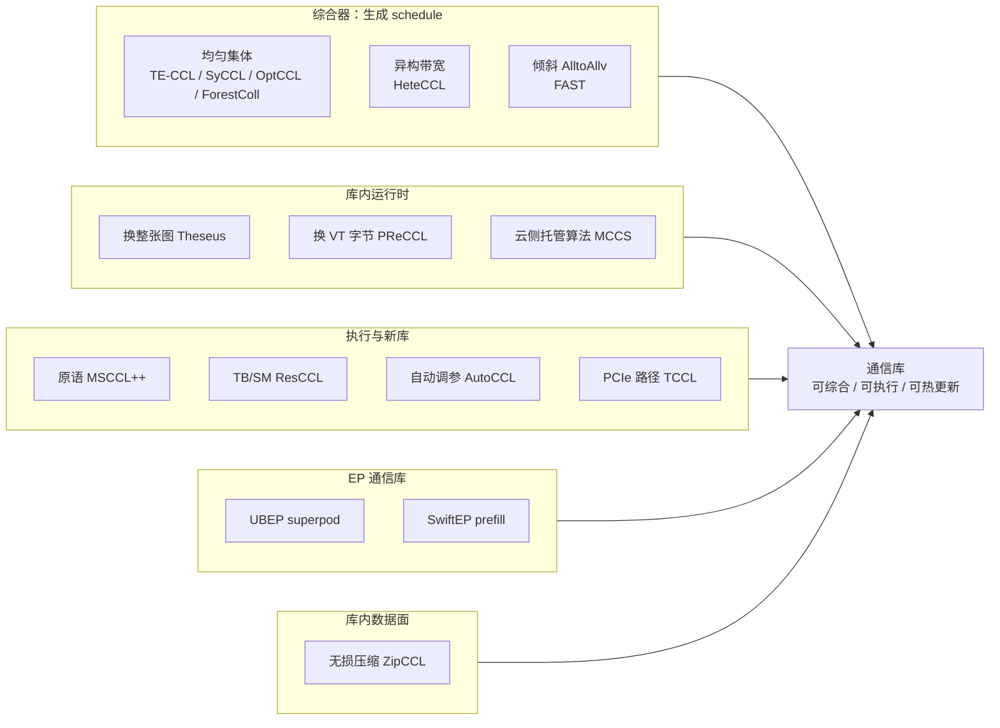
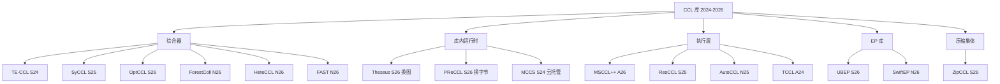

# 集合通信库优化：近两年顶会知识树（2024–2026）

范围只收 **通信库（CCL / EP comm library）本身的优化**：换算法、出 schedule、热更新、改执行原语、在库里做压缩或 AlltoAll。

不收：拥塞控制、QP/路径、数据中心织物、光交换、网内交换机聚合、集群作业调度、训练框架切并行、诊断工具。祖先 TACCL / MSCCLang / SCCL / MSCCL（2021–2023）只作树根。

---

## 收录 / 不收录

**收录（主产物是一张库、一套 schedule、或库内数据面）**

- 综合器：TE-CCL、SyCCL、OptCCL、HeteCCL、ForestColl、FAST
- 运行时：Theseus、PReCCL、MCCS
- 执行 / 新库：MSCCL++、ResCCL、AutoCCL、TCCL
- EP 通信库：UBEP、SwiftEP
- 库内压缩集体：ZipCCL

**明确不收（上一版混进来、这次拿掉）**

- 传输：HPN、Elastic QP、Odin、STORM、PSN-PATH、FuseLink
- 织物 / INC：Harvest、Trivance、TurboBus、EPIC、HyNA、Turbo、Opus
- 集群调度 / 诊断：LEVELLER、MonkeyTree、Aegis、Mycroft、Greyhound、MegaScale、Meta 100K 栈
- 只挂 DDP hook、不改库：DynamiQ（量化多跳 AllReduce，走 NCCL P2P）

---

## 1. 鱼骨：通信库在优化什么

把头看成目标：**NCCL/RCCL 那套「启动时固定 Ring/Tree + α-β 选一次」不够用，在库里把它变成可综合、可执行、可热更新。**

```text
              固定算法次优              异构拓扑综合不动
                    |                        |
    AlltoAll 倾斜 --+----+----+----+----+----+-- 集体完成时间被最慢 VT 卡住
                         |
                         +----【通信库】---- SM/TB 浪费、原语太粗
                         |
    长作业中途漂移 --+----+----+----+----+----+-- MoE 不规则，经典集体语义不够
                    |                        |
              云租户看不见物理网          传的字节太多（压缩）
```



---

## 2. 知识树

纵向是库里的职责，横向是近两年代表工作。

```text
通信库优化 2024–2026
│
├── 综合：作业前（或近线）算出 schedule，交给执行器
│     ├── 均匀集体 + 对称/一般拓扑
│     │     TE-CCL      SIGCOMM'24   多商品流；执行靠 MSCCL/RCCL
│     │     SyCCL       SIGCOMM'25   对称切分，生产规模；相对 TE-CCL 综合快 2–4 个数量级
│     │     OptCCL      SIGCOMM'26   时空解耦，可扩展最优
│     │     ForestColl  NSDI'26      多项式时间、吞吐最优生成树打包，导出 MSCCL/RCCL
│     ├── 异构带宽
│     │     HeteCCL     NSDI'26      SMT + CEGIS；H20+V100，相对 TACCL/TE-CCL 综合快约 100×
│     └── 不规则 AlltoAllv
│           FAST        NSDI'26      机内再平衡 + Birkhoff matching；64 GPU ~221 us
│
├── 运行时：集体之间改库的数据面，不重启作业
│     ├── 换整张 schedule
│     │     Theseus     SIGCOMM'26   预置只有 Ring；NewSched 灌候选；资源树 + delta 迁移
│     ├── 不换图，只改各 VT 字节
│     │     PReCCL      SIGCOMM'26   VT-stall 带内遥测；CCT 边界重切；NCCL patch
│     └── 算法选择上收到云
│           MCCS        SIGCOMM'24   Collective-as-a-Service；租户仍看 NCCL API
│
├── 执行：同一张图怎么在 GPU 上跑
│     MSCCL++   ASPLOS'26   原语 / DSL / 集体 API 三层；Azure 推理，RCCL 已吸收
│     ResCCL    SIGCOMM'25  send / recvReduceCopy 级 TB 调度，减 SM
│     AutoCCL   NSDI'25     自动搜算法/协议/chunk；仍停在 NCCL 静态空间
│     TCCL      ASPLOS'24   PCIe/NUMA 上搜路径，改 NCCL runtime
│
├── EP 通信库：绕开经典 AllReduce 语义
│     UBEP      SIGCOMM'26  superpod All-to-All；打破 BSP；Data-as-Flag
│     SwiftEP   NSDI'26     MoE prefill；buffer fusion + TMA；对标 DeepEP
│
└── 库内压缩集体
      ZipCCL    SIGCOMM'26  AllGather / AlltoAll / ReduceScatter 无损压缩入口
```



---

## 3. 分层对照

### 3.1 综合器：决定「走哪张图」

| 工作 | 会议 | 输入 | 输出交给谁 | 相对 NCCL |
| --- | --- | --- | --- | --- |
| TE-CCL | SIGCOMM'24 | 拓扑 + 集体 + 需求矩阵 | MSCCL/RCCL 可执行 schedule | 测试床优于 TACCL / RCCL |
| SyCCL | SIGCOMM'25 | 对称拓扑 + 集体 | 子 schedule 再拼完整图 | 生产仿真最多约 +127% 集体性能 |
| OptCCL | SIGCOMM'26 | 同上，要最优且可扩展 | 最优算法 | 补 TE-CCL/SyCCL 的最优性 |
| ForestColl | NSDI'26 | 任意异构织物 | 生成树 schedule → MSCCL/RCCL | 多项式时间、吞吐最优 |
| HeteCCL | NSDI'26 | 异构 GPU/链路带宽 | 近优 schedule | H20+V100 带宽最多约 2.8× NCCL |
| FAST | NSDI'26 | 倾斜 alltoallv | us 级 matching | 对标 NCCL / DeepEP / TACCL |

共同缺口：出的是静态图。hash 极化、单 VT 变慢、单 NIC 降速之后，图本身不再最优——这是下一层运行时的事。

### 3.2 库内运行时：不打断集体语义的前提下改数据面

| 工作 | 会议 | 改库里的什么 | 何时改 | 不改什么 |
| --- | --- | --- | --- | --- |
| Theseus | SIGCOMM'26 | 整张 schedule（全局/GPU/TB/OP） | 候选之间热插拔；agreement 每 N 次集体 | 不在线重综合；预置只有 Ring |
| PReCCL | SIGCOMM'26 | 已有 channel/VT 上的字节区间 | 一次集体（CCT）边界 | 不换拓扑、不拆 QP 序 |
| MCCS | SIGCOMM'24 | 云侧算法与路径策略 | 提供者动态调整 | 租户应用不改 API |

Theseus 评测里真正灌进去的图：分层 mesh/ring/双二叉树、AlltoAll 两档（低倾斜 PXN 形 vs 高倾斜 FAST-lite）、16 张单 NIC 同节点中继、TECCL 两套中间解、9 种 TB 网格。数字：稳态最多约 1.61×、动态最多约 2.46×（相对 NCCL，混有 MSCCL++ 空间）、fail-slow JCT 最多约 1.84×、MoE EP32 约 1.07×。

PReCCL：1024 卡 H200 约两周、146 作业，JCT 中位/P95 约 -5.7% / -51.2%；部分 NIC 故障约 5 RTT、保留约 78% 带宽。

三者不可替代：

- 换图：候选里已有另一套结构（绕开某 NIC、换 AlltoAll 档）。
- 换字节：图还对，各 VT 完成时间散开。
- 云托管：租户看不见物理拓扑，选择权不该在进程内库。

### 3.3 执行：同一张图怎么占 GPU

| 工作 | 会议 | 一句话 |
| --- | --- | --- |
| MSCCL++ | ASPLOS'26 | 原语暴露硬件、DSL 写算法、集体 API 兼容 NCCL；推理 geomean 约 1.7× |
| ResCCL | SIGCOMM'25 | 原语级 TB 调度；带宽最多约 2.5×，SM 占用降约 78% |
| AutoCCL | NSDI'25 | tuner plugin 自动搜算法/协议/chunk；不增加新算法结构 |
| TCCL | ASPLOS'24 | 给 PCIe/NUMA 集群搜路径，LD_PRELOAD 进 NCCL |

PReCCL 的 VT 要可观测，前提是执行层里 **一条 VT = 一条独立 FIFO**（NCCL 里通常是一个 channel）。

### 3.4 EP 通信库

经典 AllReduce/AllGather 语义覆盖不了 token 级 dispatch/combine。

| 工作 | 会议 | 要点 |
| --- | --- | --- |
| UBEP | SIGCOMM'26 | CloudMatrix 类 superpod；细粒度按数据就绪调度；All-to-All 延迟最多约 -52% |
| SwiftEP | NSDI'26 | MoE prefill；零拷贝 buffer fusion + TMA；相对 DeepEP 算法带宽最多约 +120% |

工业对照（非顶会论文）：DeepEP、NCCL EP、Hybrid-EP。FAST 给 EP 的 alltoallv 提供在线 scheduler，和这两座库是上下游。

### 3.5 库内压缩

| 工作 | 会议 | 要点 |
| --- | --- | --- |
| ZipCCL | SIGCOMM'26 | 给 AllGather / AlltoAll / ReduceScatter 加无损压缩入口；通信时间最多约 1.35× |

可叠在任意综合器/运行时之上：先定图和字节，再压每个 chunk。

---

## 4. 时间线（只保留库）

```text
2023          TACCL / MSCCLang / MSCCL     综合器 + 可执行 IR 成型
2024 ASPLOS   TCCL                         PCIe 集群改 NCCL
     SIGCOMM  TE-CCL, MCCS
2025 NSDI     AutoCCL
     SIGCOMM  SyCCL, ResCCL
2026 ASPLOS   MSCCL++
     NSDI     HeteCCL, ForestColl, FAST, SwiftEP
     SIGCOMM  OptCCL, Theseus, PReCCL, UBEP, ZipCCL
```

---

## 5. 怎么读：两个问题

**库改的是哪一类对象？**

| 对象 | 工作 | 典型场景 |
| --- | --- | --- |
| 新算法图 | TE-CCL / SyCCL / OptCCL / ForestColl / HeteCCL | 拓扑已知、需求稳定 |
| 倾斜 matching | FAST | MoE 每几百 ms 变的 alltoallv |
| 运行时换图 | Theseus | 单 NIC 降速、综合器中途倒出更好的图 |
| 运行时换字节 | PReCCL | 多租户下 VT 快慢不齐 |
| 原语 / TB | MSCCL++ / ResCCL / AutoCCL | 同一张图，SM 和带宽 |
| EP 原语 | UBEP / SwiftEP | dispatch/combine，不走 NCCL 集体 |
| 压缩入口 | ZipCCL | 带宽不够、精度不能丢 |

**仍空着的一层**

综合器离线出图，Theseus/PReCCL 只热更新已有对象。没有顶会工作做 **运行时增量重综合**：漂移发生后当场长出一张新的合法 schedule。OptCCL/SyCCL 太慢，FAST 只覆盖 alltoallv。

---

## 6. 和 NVL72 动态 VT 的对齐（仍只谈库）

| 库结论 | 设计含义 |
| --- | --- |
| PReCCL：VT stall 可观测，epoch 在 CCT 边界 | VT = NCCL channel = 1 QP |
| Theseus：换图要预计算候选 | 首期只做换字节；换图接口预留 |
| FAST：incast 用一对一 matching | 不把跨 tray 同 index NIC 当自适应路由 |
| AutoCCL / NCCL tuner：只在静态空间调 | 不够覆盖 ECMP 极化，必须有运行时字节层 |
