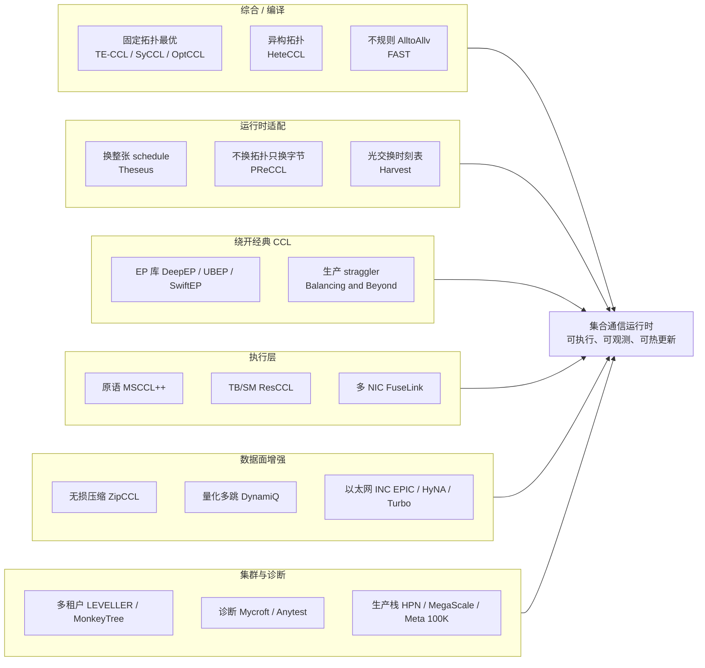

# 集合通信运行时：近两年顶会知识树（2024–2026）

范围：SIGCOMM / NSDI / OSDI / SOSP / ASPLOS / EuroSys 等系统与网络顶会，聚焦 **GPU 集合通信（CCL）运行时**——如何把一次 AllReduce / AllGather / ReduceScatter / AlltoAll(v) **编译成可执行 schedule，并在漂移、故障、不规则流量下仍跑得接近最优**。不含纯并行策略（Megatron 切法）和纯拥塞控制，除非它们直接改了 CCL 数据面。

时间窗以 2024–2026 为主；2023 的 TACCL / MSCCLang 只作为树根，不展开。

---

## 1. 问题怎么切：一条鱼骨

把头看成目标：**把「拓扑 + 集体语义 + 瞬时网络」映射成可热更新的数据面**。

```text
                    静态算法过时          流量不规则(MoE)
                         |                    |
异构拓扑 / 带宽不对称 ----+----+----+----+----+---- 网内聚合 INC
                              |
                              +----【集合通信运行时】---- 多租户抢带宽
                              |
执行原语 / SM / TB 浪费 ----+----+----+----+----+---- 压缩 / 量化数据面
                         |                    |
                    漂移与故障              可观测性 / 诊断
```

更规范的 Ishikawa 鱼骨（Mermaid）：



---

## 2. 知识树（按栈分层）

树的纵向是 **谁决定什么时候改什么**；横向是 **近两年代表工作**。

```mermaid
flowchart TD
  root["CCL Runtime Stack 2024-2026"]

  root --> L4["L4 综合：生成 schedule"]
  root --> L3["L3 运行时：热更新 / 重分配"]
  root --> L2["L2 执行：channel / TB / 原语"]
  root --> L1["L1 传输：QP / 路径 / NIC"]
  root --> L0["L0 互联：scale-up / scale-out"]
  root --> LX["旁路：EP 库 / INC / 压缩 / 公平性"]

  L4 --> L4a["均匀集体 + 对称拓扑"]
  L4a --> P_TE["TE-CCL SIGCOMM24<br/>多商品流"]
  L4a --> P_SY["SyCCL SIGCOMM25<br/>对称分解，生产规模"]
  L4a --> P_OPT["OptCCL SIGCOMM26<br/>时空解耦，可扩展最优"]

  L4 --> L4b["异构 / 不规则"]
  L4b --> P_HE["HeteCCL NSDI26<br/>SMT + CEGIS"]
  L4b --> P_FA["FAST NSDI26<br/>Birkhoff matching, us 级"]

  L3 --> L3a["换算法"]
  L3a --> P_TH["Theseus SIGCOMM26<br/>预计算 schedule 热插拔"]
  L3 --> L3b["不换算法"]
  L3b --> P_PR["PReCCL SIGCOMM26<br/>VT stall + CCT epoch + 字节迁移"]
  L3 --> L3c["换光开关时刻表"]
  L3c --> P_HV["Harvest SIGCOMM26"]

  L2 --> P_MS["MSCCL++ ASPLOS26<br/>GPU 通信原语"]
  L2 --> P_RE["ResCCL SIGCOMM25<br/>TB/原语调度"]
  L2 --> P_CR["Crux SIGCOMM24<br/>GPU 强度感知"]
  L2 --> P_FL["FuseLink OSDI25<br/>多 NIC 借路"]

  L1 --> P_HPN["HPN SIGCOMM24<br/>hash 极化 / 故障"]
  L1 --> P_EQP["Elastic QP SIGCOMM26"]
  L1 --> P_OD["Odin SIGCOMM26<br/>AlltoAll 拥塞"]
  L1 --> P_ST["STORM SIGCOMM26<br/>RDMA 流量调度"]

  L0 --> P_TR["Trivance SIGCOMM26<br/>多端口 AllReduce"]
  L0 --> P_TB["TurboBus SIGCOMM26<br/>PCIe 池化"]
  L0 --> P_FP["FabricPerf SIGCOMM26"]
  L0 --> P_META["Connecting 100K GPUs SIGCOMM26"]

  LX --> EP["EP 不规则"]
  EP --> P_UB["UBEP SIGCOMM26"]
  EP --> P_BB["Balancing and Beyond SIGCOMM26"]
  EP --> P_SW["SwiftEP NSDI26"]

  LX --> INC["网内集体"]
  INC --> P_EPIC["EPIC SIGCOMM26"]
  INC --> P_HY["HyNA SIGCOMM26"]
  INC --> P_TU["Turbo SIGCOMM26"]

  LX --> CMP["压缩数据面"]
  CMP --> P_ZIP["ZipCCL SIGCOMM26"]
  CMP --> P_DQ["DynamiQ SIGCOMM26"]

  LX --> MT["多租户"]
  MT --> P_LV["LEVELLER SIGCOMM26"]
  MT --> P_MK["MonkeyTree SIGCOMM26"]
  MT --> P_AE["Aegis SIGCOMM26"]

  LX --> OBS["可观测"]
  OBS --> P_MY["Mycroft SOSP25"]
  OBS --> P_AT["Anytest SIGCOMM26"]
```



---

## 3. 分层对照表

### 3.1 L4 综合：离线（或近线）决定「走哪张图」

| 工作 | 会议 | 核心问题 | 做法 | 相对 NCCL 的位置 |
| --- | --- | --- | --- | --- |
| TE-CCL | SIGCOMM'24 | MILP/搜索爆炸 | 多商品流建模集体 | 生成 XML/schedule，交给 MSCCL 一类执行器 |
| SyCCL | SIGCOMM'25 | 生产规模综合太慢 | 用拓扑与集体的对称性切成子问题再拼 | 阿里生产：ring 浪费约 10.6% 带宽、小消息延迟约 4x |
| OptCCL | SIGCOMM'26 | 既要最优又要可扩展 | 空间与时间解耦后再综合 | 补 TE-CCL/SyCCL 的最优性缺口 |
| HeteCCL | NSDI'26 | H20+V100 等异构带宽 | 加权图最大并行传输 + SMT/CEGIS | 相对 TACCL/TE-CCL 综合快约两个数量级 |
| FAST | NSDI'26 | MoE 每几百 ms 变的 alltoallv | 机内再平衡 + Birkhoff 一对一 matching | 64 GPU 综合约 221 us，可跟 token 路由走 |

祖先（树根，不计入「近两年」主表）：TACCL (NSDI'23)、MSCCLang (ASPLOS'23)、SCCL、MSCCL。

**缺口：** 综合器输出的是一张（或一组）静态图。集群一旦 hash 极化、局部降速、部分 NIC 挂掉，这张图就不再最优。这正是 L3 出现的原因。

### 3.2 L3 运行时：在不打断集体语义的前提下改数据面

| 工作 | 会议 | 改什么 | 何时改 | 不改什么 |
| --- | --- | --- | --- | --- |
| Theseus | SIGCOMM'26 | 整张 schedule（四层：全局/GPU/TB/OP） | 用户 `NewSched` 灌入候选；资源树 + delta 迁移 + 每 N 次集体 AllReduce 对齐上下文 | 本体只预置 NCCL Ring；不在线重综合；评测候选见下 |
| PReCCL | SIGCOMM'26 | 已有 channel/VT 上的字节区间 | CCT（一次集体）边界 | 不换拓扑、不拆 QP 序、不喷包 |
| Harvest | SIGCOMM'26 | 光交换 / scale-up 的时隙表 | 按集体需求自适应 | 对象是光开关，不是 Ethernet QP |
| FAST | NSDI'26 | alltoallv matching | 每个 MoE 步（us 级） | 针对不规则矩阵，不是均匀 AllReduce |

Theseus 数字（论文）：稳态最多约 1.61×（混有 MSCCL++ 空间）、动态最多约 2.46×、fail-slow JCT 最多约 1.84×、MoE EP32 约 1.07×。本体不是综合器：预置只有 Ring，其余图由用户/TECCL 塞进 context。评测实际用过的图：分层 mesh/ring/双二叉树（AG/AR/BC/RS）、AlltoAll 两档（低倾斜 PXN 形 vs 高倾斜 FAST-lite）、单 NIC 降速 16 张同节点中继变体、TECCL 两套中间解、9 种 TB 网格。

PReCCL 数字：1024 卡 H200 约两周、146 个作业，JCT 中位/P95 约 -5.7% / -51.2%；部分 NIC 故障约 5 RTT 收敛、保留约 78% 带宽。

**L3 内部再分叉：**

- **换图（Theseus）**：故障域、拓扑对称性被打破、需要另一套 ring/tree/hierarchical。
- **换字节（PReCCL）**：图还对，但各 VT 完成时间散开（ECMP 碰撞、incast、局部降速）。
- **换 matching（FAST）**：需求矩阵本身在变。

三者不可互相替代。换图解决不了「同一套 ring 上某条 VT 被 hash 打满」；换字节解决不了「ring 在该拓扑上根本次优」。

### 3.3 L2 执行：schedule 真正跑在 GPU 上

| 工作 | 会议 | 一句话 |
| --- | --- | --- |
| MSCCL++ | ASPLOS'26 | 把 GPU 通信拆成可组合原语；Azure 推理生产，RCCL 已吸收 |
| ResCCL | SIGCOMM'25 | 在 send / recvReduceCopy 等原语级调度 TB，减 SM 占用 |
| Crux | SIGCOMM'24 | 按 GPU 计算强度调度通信，避免通信饿死计算 |
| FuseLink | OSDI'25 | 机内 NVLink/P2P 把流量借到空闲 NIC；点对点/MoE 更赚，均匀 ring 收益有限 |
| TCCL | ASPLOS'24 | PCIe/NUMA 集群上的路径搜索 + 改 NCCL runtime |
| AutoCCL | NSDI'25 | 自动搜算法/协议/chunk，仍停在 NCCL 静态空间内 |

这一层回答的是：**同一张逻辑图，用多少 SM、多少 TB、哪块 NIC 发出去**。PReCCL 的 VT 要可观测，前提是 L2 里 **一条 VT = 一条独立 FIFO 管道**（在 NCCL 里通常就是一个 channel）。

### 3.4 L1 传输：QP、路径、故障

| 工作 | 会议 | 与 CCL 的接口 |
| --- | --- | --- |
| HPN | SIGCOMM'24 | 阿里 GPU 集群：hash 极化、NIC–ToR 故障约 0.057%/月、绝大多数作业 <1K GPU |
| Elastic QP | SIGCOMM'26 | rack-scale 细粒度互联，QP 作为一等资源 |
| Odin | SIGCOMM'26 | All-to-All 流量下重做拥塞控制 |
| STORM | SIGCOMM'26 | 给 RDMA 做流量调度 |
| PSN-PATH | SIGCOMM'26 | 有损网上的多路径 RDMA |
| MegaScale | NSDI'24 | 万卡训练：NCCL 超时/重传、ECMP 冲突、集体尾延迟 |
| Meta 100K GPU 通信栈 | SIGCOMM'26 | 超大规模训练通信栈工程 |

HPN / MegaScale 说明：**运行时必须把「网络瞬时态」当成一等输入**，而不是只在作业启动时读一次 `ibstat`。

### 3.5 L0 互联与 scale-up

| 工作 | 会议 | 点 |
| --- | --- | --- |
| Harvest | SIGCOMM'26 | 光子 scale-up 上的集体时刻表 |
| Trivance | SIGCOMM'26 | 多端口网上 shortcut AllReduce，优化延迟 |
| TurboBus | SIGCOMM'26 | 用 scale-up 织物池化 PCIe 带宽 |
| FabricPerf | SIGCOMM'26 | 无 NIC 的 scale-up，用 GPU 通信 kernel 测 |
| Opus | SIGCOMM'26 | ML 数据中心光子 rail 织物 |
| Balanced Sparse Tree | SIGCOMM'26 | 面向 LLM 的可扩展拓扑 |
| PingPoint | SIGCOMM'26 | accelerator chiplet 网络剖析 |

NVL72 / NVL576 / CloudMatrix 这类 **统一地址空间 superpod** 把「机内 NVLink」和「机间 RDMA」合成一张图，直接催生 UBEP，也改变 PXN / rail 的默认假设。

---

## 4. 旁路枝：经典 CCL 覆盖不住的四类需求

### 4.1 Expert Parallelism：不规则、延迟敏感、常绕开 NCCL

| 工作 | 出处 | 要点 |
| --- | --- | --- |
| DeepEP | 工业库（DeepSeek） | dispatch/combine；V2 走 NCCL GIN + 对称窗口，不再绑 NVSHMEM |
| Hybrid-EP | NVIDIA | DeepEP 分支上的混合路径 |
| UBEP | SIGCOMM'26 | superpod：打破 BSP 粗同步，Data-as-Flag，距离感知调度 |
| SwiftEP | NSDI'26 | MoE prefill：buffer fusion + TMA，对 DeepEP 减拷贝、减 SM |
| Balancing and Beyond | SIGCOMM'26 | 阿里生产：把 EP straggler 收到通信层（Qwen/DeepSeek 量级） |
| FAST | NSDI'26 | 给 alltoallv 一个能在线跑的 scheduler |

EP 枝与均匀 AllReduce 枝在运行时上几乎正交：前者的瓶颈是 **incast + 负载倾斜 + 同步粒度**；后者是 **多 VT 完成时间对齐 + 拓扑算法**。

### 4.2 压缩 / 量化：改的是「传多少」而不是「怎么传」

| 工作 | 会议 | 点 |
| --- | --- | --- |
| ZipCCL | SIGCOMM'26 | 集体上的无损压缩 |
| DynamiQ | SIGCOMM'26 | 拓扑感知的量化多跳 AllReduce |

它们可以叠在任意 L3/L4 之上：先决定图和字节分配，再决定每个 chunk 是否压缩。

### 4.3 网内集体（INC）

| 工作 | 会议 | 点 |
| --- | --- | --- |
| EPIC | SIGCOMM'26 | 以太网上 INC 的抽象与多态 |
| HyNA | SIGCOMM'26 | 用交换机 ASIC 打 MoE 尾延迟 |
| Turbo | SIGCOMM'26 | 长上下文 serving 的网内聚合 |

INC 把 reduce 从 GPU 挪到交换机。运行时含义：CCT 的「完成」不再只由 endpoint VT 决定，还取决于交换机流水线是否可抢占、是否保序。

### 4.4 多租户与集群调度

| 工作 | 会议 | 点 |
| --- | --- | --- |
| LEVELLER | SIGCOMM'26 | 按进度速率公平调度通信 |
| MonkeyTree | SIGCOMM'26 | 用迁移换近最小拥塞 |
| Aegis | SIGCOMM'26 | 加速器集群上契约约束的在线适配 |
| GeoOrchestra | SIGCOMM'26 | 跨地理异构训练的网络感知调度 |
| MCCS | SIGCOMM'24 | 多租户云上把集体做成服务 |
| PIPEMORPH | NSDI'26 | 流水线遇到通信 straggler 时改 schedule / 卸载通信 |

多租户是 PReCCL 生产收益（P95 JCT -51%）的主要来源之一：单租户均匀 ring 往往已经不错，**被邻居 Polarize 之后**才需要 L3。

### 4.5 可观测性（运行时的眼睛）

| 工作 | 会议 | 点 |
| --- | --- | --- |
| Mycroft | SOSP'25 | 跟踪集体内部依赖，定位卡住的 CollOp，避免全量 Nsight/NPKit |
| Greyhound | ATC'25 | 混合并行训练里猎 fail-slow，shim 拦 NCCL 时间戳 |
| Anytest | SIGCOMM'26 | 硬件传输性能异常的根因定位（阿里） |
| MegaScale 诊断工具 | NSDI'24 | 万卡稳定性：超时、抖动、straggler |

PReCCL 的 VT-stall INT 属于 **带内、每集体、低开销** 的观测；Mycroft 属于 **出事后追依赖**。两者叠在不同时间尺度。

---

## 5. 一张时间线（只保留运行时主链）

```text
2023          TACCL / MSCCLang                 综合器成型
2024 SIGCOMM  TE-CCL, Crux, HPN
     NSDI     MegaScale（万卡 NCCL 工程）
2025 SIGCOMM  SyCCL, ResCCL
     OSDI     FuseLink
     SOSP     Mycroft
2026 ASPLOS   MSCCL++
     NSDI     HeteCCL, FAST, SwiftEP, PIPEMORPH
     SIGCOMM  OptCCL | Theseus | PReCCL | UBEP
              ZipCCL | DynamiQ | EPIC | HyNA
              Harvest | Trivance | Elastic QP
              Balancing and Beyond | LEVELLER
              Meta 100K GPU stack
```

---

## 6. 怎么读这棵树：三个正交轴

把论文按三个问题归类，比按会议归类更不容易混。

**轴 A — 需求是否规则**

- 规则（DP/TP AllReduce、AllGather）：SyCCL / OptCCL / Theseus / PReCCL / ZipCCL
- 不规则（MoE dispatch/combine、alltoallv）：FAST / UBEP / SwiftEP / DeepEP / Balancing and Beyond

**轴 B — 何时做决定**

- 作业前 / 分钟级：TE-CCL、SyCCL、OptCCL、HeteCCL
- 集体间 / 毫秒–微秒：Theseus、PReCCL、FAST、Harvest
- 包级：拥塞控制（Odin 等），**不应**拆开单 QP 上的集体 FIFO

**轴 C — 改哪一层对象**

```text
schedule 图     Theseus, SyCCL, OptCCL, HeteCCL
matching        FAST
字节 <-> VT     PReCCL
TB / SM         ResCCL, MSCCL++
NIC / 路径      FuseLink, Elastic QP, HPN
光时隙          Harvest
交换机 reduce   EPIC, HyNA
```

---

## 7. 和 NVL72 动态 VT 设计的对齐

本仓库 NVL72 方案落在 **轴 B 的集体间 + 轴 C 的字节<->VT**，刻意不做轴 C 的「换图」和「喷包」：

| 顶会结论 | 设计里的对应 |
| --- | --- |
| PReCCL：VT stall 可观测，epoch 在 CCT 边界 | VT = NCCL channel = 1 QP，禁止 channel 内多 QP 条带 |
| Theseus：换图成本高、要预计算 | 非 Spectrum、无 OOO/SACK 时，优先 L1 同轨换路径，而不是在线重综合 |
| FAST：incast 要用一对一 matching | 跨 tray 同 index NIC 不能当 AR；incast 走 NVLink/PXN 中继，且 PXN 不出 OS |
| FuseLink：均匀 ring 借 NIC 收益有限 | L2 跨 rail 只在整轨/incast 时启用 |
| HPN / MegaScale：ECMP 极化是常态 | L1 先做 intra-rail path shift |
| Mycroft：集体内部有依赖图 | 不能在集体中途切 VT 映射，否则依赖边断裂 |

**仍然空着的一层（L3.5）：** 没有顶会工作给出「在运行时 **增量重综合** 一张合法 schedule」——OptCCL/SyCCL 太慢，Theseus 只在候选集里换，PReCCL 不换图。这是下一跳研究位，不是当前 NVL72 方案该填的坑。

---

## 8. 易混论文（点名避免）

- **Theseus（SIGCOMM'26 CCL）** ≠ 数据库/查询引擎里的 Theseus。
- **FAST（NSDI'26 alltoallv scheduler）** ≠ 存储会议 FAST。
- **Turbo（网内聚合 serving）** ≠ TurboBus（PCIe 池化）。
- **Aegis（SIGCOMM'26 在线适配）** ≠ 只记 RDMA WR 统计的早期 Aegis 测量工具（Mycroft 相关工作里提到的那种）。

---

## 9. 阅读顺序建议

1. 先读 **SyCCL + OptCCL**：搞清「静态最优图」今天能做到哪。
2. 再读 **Theseus + PReCCL**：看运行时两条路（换图 vs 换字节）。
3. 并行读 **FAST + UBEP + Balancing and Beyond**：MoE 为什么经常不走 NCCL。
4. 补 **MSCCL++ / ResCCL**：执行层决定 VT 能不能被观测和热改。
5. 最后读 **HPN + MegaScale + Meta 100K**：生产约束（故障率、ECMP、超时）决定哪些论文技巧能落地。
